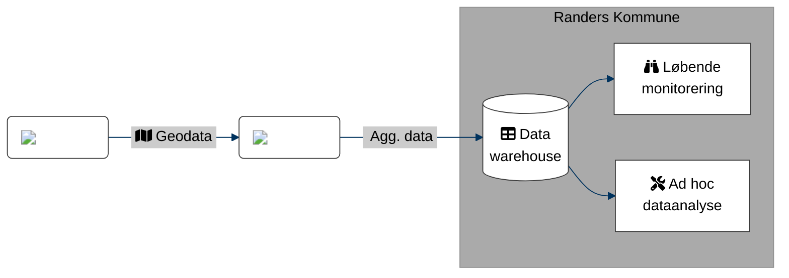

<link
  href="https://cdnjs.cloudflare.com/ajax/libs/font-awesome/6.7.0/css/all.min.css"
  rel="stylesheet"
/>

<!-- 
Model 1:
Kun DST-data 

-->

```mermaid
%%{init: {'theme': 'base','themeVariables': {'primaryColor': '#fff','primaryTextColor': '#000','primaryBorderColor': '#3c3c3c','lineColor': '#00335E','secondaryColor': '#ccc',
'tertiaryColor': '#AAAAAA','tertiaryTextColor': '#000'}}}%%

flowchart LR
    FRv1("<img src='Fremtidens Randers-områder v1 opdelt på type (no legend).png'; width='30'; style="paddingmargin-top:'100'"/>") -->|&nbsp;<i class="fa-solid fa-map"></i> Geodata&nbsp;| DST1
    DST1("<img src='https://www.dst.dk/Site/Dst/images/logo_dk.svg'; width='30'; style="paddingmargin-top:'100'"; />")
    subgraph sub2[Randers Kommune]
      DW@{ shape: cyl, label: "<i class="fa-solid fa-table"></i> Data 
      warehouse" }
      Front[<i class="fa-solid fa-binoculars"></i> Løbende 
      monitorering]
      adhoc[<i class="fa-solid fa-screwdriver-wrench"></i> Ad hoc
      dataanalyse]
    end
    DST1 -->|&nbsp;<i class="fa-solid fa-square-binary"></i> Agg. data&nbsp;| DW --> Front
    DW --> adhoc 
```
